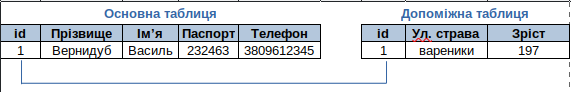
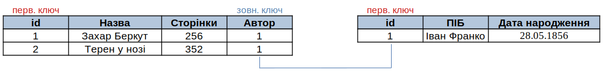
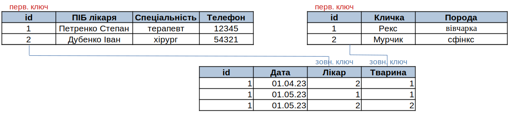

# Види зв'язків між таблицями БД
Як Ви вже знаєте, зв'язки між таблицями у реляційних базах даних визначаються за допомогою зовнішніх ключів. Ці ключі забезпечують зв'язок між полями двох або більше таблиць, які мають спільні дані.

Існує три види зв'язків між таблицями:
- Один до одного (One-to-One)
- Один до багатьох (One-to-Many)
- Багато до багатьох (Many-to-Many)

## Один до одного (One-to-One)
Цей тип зв'язку використовується тоді, коли кожен запис в одній таблиці пов'язаний з одним записом в іншій таблиці. 

Цей зв'язок не дуже поширений, оскільки зазвичай відомості, пов'язані між собою в такий спосіб, зберігаються в одній таблиці. Зв'язок "один-до-одного" можна використовувати для розділення таблиці з великою кількістю полів, для відокремлення частини таблиці з міркувань безпеки чи продуктивності. У разі визначення такого зв'язку в обох таблицях мають бути спільні поля.

(Рисунок 1. Схема Один до одного)

Наприклад у таблиці **Users** нам потрібно зберігати велику кількість полів:
*id, прізвище, ім'я, паспорт, телефон, адреса, дата народження, зріст, вага, улюблений колір, улюблений співак, улюблений актор, улюблена страва*, і т.д.
Але при цьому для робочих моментів використовується лише перші п'ять полів, а решта виводяться лише у рідких випадках. 
Щоб не викликати навантаження на базу даних і не вибирати щоразу всю інформацію з таблиці, ці дані розбивають на дві таблиці: Users та Usersinfo. Тепер, щоб існував з'язок між таблицями у таблиці Usersinfo повинне бути поле id, що міститиме теж саме значення, що і у таблиці Users.

## Один до багатьох (One-to-Many)

Цей тип зв'язку використовується тоді, коли кожен запис в одній таблиці пов'язаний з багатьма записами в іншій таблиці.
Щоб представити зв'язок "один-до-багатьох" у структурі власної бази даних, візьміть первинний ключ на стороні зв'язку "один" і вставте його як додаткове поле або поля в таблицю на стороні зв'язку "багато".
Це найпоширеніший тип зв'язку. 
Наприклад, у Магазині один Покупець може робити багато Замовлень. Зі свого боку одне Замовлення, може містити багато Товарів. Один виробник може виготовляти багато Товарів і тд. Бібліотеці один Автор може мати багато Книг, а це означає, що у таблиці (багато) Книги повинно бути поле, що містить значення первинного ключа із таблиці Автор.

(Рисунок 2. Схема Один до багатьох)
## Багато до багатьох (Many-to-Many)

Якщо повернутися до бази даних Ветклініка, то ми не визначили зв'язків між лікарями і тваринами які будуть лікуватися. З одного боку один Лікар може лікувати багато Тварин, а з іншого, одна тварина може лікуватися у багатьох лікарів. 

Отже маємо, що кожному запису з таблиці Лікарі, може відповідати багато записів з таблиці Тварини і, кожному запису з таблиці Тварини може відповідати багато записів з таблиці Лікарі.

Щоб реалізувати зв'язок "багато до багатьох", між двома таблицями, використовують третю таблицю! Вона може містити свій первинний ключ і як мінімум ще два поля, кожне з яких буде зовнішнім ключем на id лікаря та id тварини.

А виглядатиме це так:

(Рисунок 3. Схема Багато до багатьох)

## Цілісність даних

При заповненні баз даних, якщо не враховувати багатьох факторів можуть виникати різноманітні ситуації, що призведуть до порушення роботи БД.

Наприклад уявімо собі, що людина вручну повинна перевіряти унікальність первинного ключа. Якби довелося перевіряти вручну унікальність ID-паспорта - це точно могло б призвести до того, що кілька людей могли б отримати однаковий номер.

Заповнюючи дату - можна ввести її по різному 12.03.23 чи 23.03.12 помилок немає, але якщо не враховувати, що стоїть на першому місці, число чи рік.

Якщо база даних містить паролі і накладено правило на довжину пароля не менше 8 символів, то цілком би реально можна отримати ситуацію, що у когось із користувачів виявився б пароль 12345.

І нарешті, уявімо собі, що Власник кількох тварин нашої Ветклініки вирішив переїхати до іншого міста. Це означає, що інформація про нього і його тварин може бути вилучена з бази даних (необов'язково, але...). З чого починати процес видалення?
Якщо видалити тварину, то у таблиці лікування (Рисунок 3) залишаться ідентифікатори про видалену тварину, але вони при цьому вже будуть недійсні.

Чи наприклад, не можна видалити автора, якщо у базі даних присутні його книги.

Для того, щоб уникнути подібних ситуацій, у системах керування базами даних існують інструменти, що забезпечують цілісність даних. Вони захищають користувача від випадкових дій, що могли б спричинити існування неіснуючих даних.

Забезпечення цілісності даних відбувається через: 
- вибір типу для відповідного поля (*Auto increment, int, date, varchar(8)*) 
- можливість вказати, що це поле не може бути порожнім (*NOT NULL*)
- у момент створення зовнішніх ключів (*забезпечує, що значення зовнішнього ключа збігаються зі значенням первинного ключа у зв'язаній таблиці.*)

### Rescrict та Cascade
При створенні зовнішніх ключів існує можливість передбачити тип цілісності даних вказавши, що саме потрібно робити, якщо відбувається видалення у головній, чи другорядній таблицях.

#### Rescrict 
У головній таблиці Власники ми не можемо видалити людину, якщо у другорядній таблиці Тварини є запис, що вказує на даного власника.

#### Cascade

Це параметр, який вказує на те, що дії, виконані на головній таблиці, повинні бути каскадно виконані на залежних таблицях. Зазвичай, якщо рядок в головній таблиці видаляється або оновлюється, відповідні рядки в залежних таблицях також повинні бути видалені або оновлені.

Наприклад, якщо ви маєте таблиці "категорії" та "продукти", де продукти залежать від категорій (категорія має багато продуктів), і ви використовуєте каскадне видалення, то при видаленні категорії всі продукти, які належать до цієї категорії, також будуть видалені з таблиці "продукти".

#### Що обрати Rescrict чи Cascade
Обираючи між Restrict та Cascade для зовнішнього ключа, слід виходити з того, як повинна діяти база даних у випадку видалення або оновлення батьківського запису.

Якщо ви хочете попередити видалення дочірніх записів при видаленні батьківського запису, то краще використовувати Restrict.

Якщо ви хочете, щоб дочірні записи були автоматично видалені при видаленні батьківського запису, використовуйте Cascade.

Використання Cascade слід розглядати з обережністю, оскільки воно може привести до непередбачуваних наслідків. Зокрема, воно може призвести до видалення даних, які не мають жодного відношення до запису, що видаляється.

Отже, при виборі між Restrict та Cascade слід виходити з конкретного випадку використання та зважувати на можливі наслідки використання кожної з цих опцій.

## Завдання

Розгляньте описану нижче ситуацію, та побудуйте схему бази даних встановивши відповідні зв'язки між таблицями.

*На підприємстві виготовляють продукти харчування, що відносяться до категорій (вироби з тіста, солодощі, напої). Товари закуповують магазини.*

- Побудуйте базу даних, що містить таблиці (Товари, Категорії, Магазини, Закупівля)
- Назви полів та їх кількість визначте самостійно. 
- Встановіть зв'язки між таблицями визначивши зовнішні ключі.
- Заповніть таблицю "Категорії товарів" відповідними назвами.
- Додайте по одному товару кожної категорії, та не менше 2-х магазинів. 
- Забезпечте зберігання інформації про закупівлю (Коли і який магазин закуповував товар)
- При необхідності додайте ще таблицю....